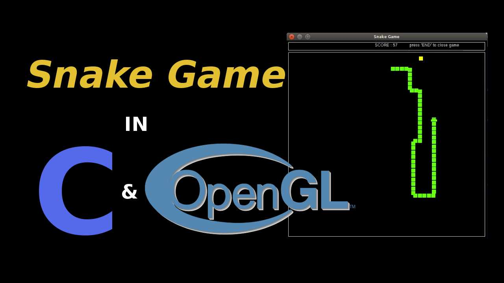

# snake-game
Vintage Egg eating snake game in 2D

	

Development is being done completely in C language.

Using OpenGL for graphics

Requirements for host machine:

Host Operating system : Linux

Packages to be installed : GLUT, GCC

A sample demo play link: https://www.youtube.com/embed/rw9PA6JAMwI 
